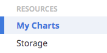
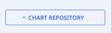
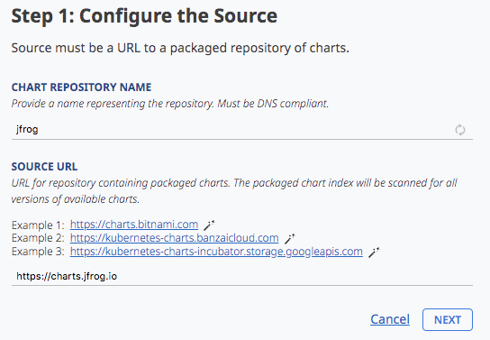
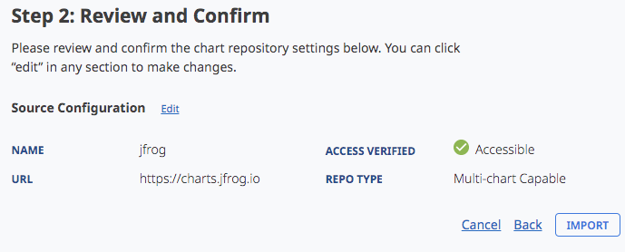
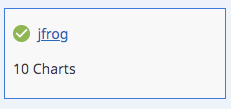
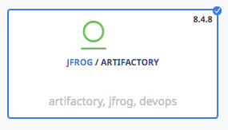
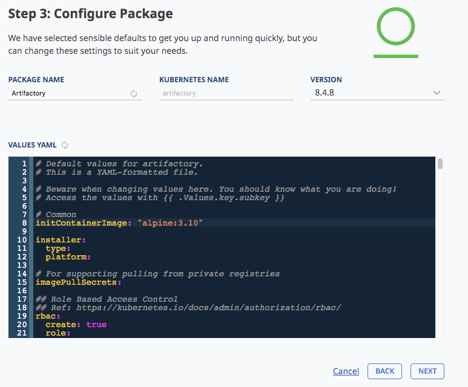
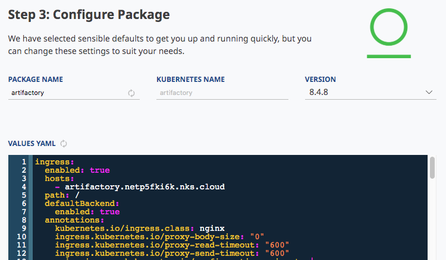

# NKS on HCI - Deploy Artifactory


### Import JFrog Helm Charts

First, let's add the JFrog repository to make the official Artifactory Helm charts available to deploy from NKS.

* From the left-hand pane, select `My Charts`
    * 

* Click `+ Chart Repository`
    * 

* Set the name to `jfrog`

* Set the Source URL to `https://charts.jfrog.io`
    * 

* Click `Next`. NKS will verify the repository is accessible. 
* Once access is verified, Click `Import` to create the repository.
    * 

* Back on the Chart Repositories page, NKS will start scanning the repository for Helm charts. After a few moments, we can see the charts have been imported, making them available for deployment to our cluster.
    * 


### Configure and Deploy Artifactory

* Create a new project, and assign it to your target cluster.
* Add a new solution to your new project
* Select the `Package` type
* At the chart selection screen, enter `Artifactory` into the search, and select the Artifactory chart from the `JFrog` repo:
    * 
* You should land on the configuration page:
    * 

### Configuring Artifactory

Now we're ready to configure the deployment. We'll base our configuration from the [template defined here](./templates/artifactory.yaml).

#### Ingress 

To configure the ingress controller, we just need our cluster id. The cluster id is the random prefix of the cluster nodes.

In this example, the cluster id is `netp5fki6k`.
```
~ kubectl get nodes
NAME                      STATUS   ROLES
netp5fki6k-master-1       Ready    master
netp5fki6k-pool-1-gqtkl   Ready    <none>
netp5fki6k-pool-1-trjhx   Ready    <none>
```

Replace `<YOUR_CLUSTER_ID>` in the template with your own cluster id.

```
ingress:
  enabled: true
  hosts:
    - artifactory.<YOUR_CLUSTER_ID>.nks.cloud
  path: /
  defaultBackend:
    enabled: true
  annotations:
    kubernetes.io/ingress.class: nginx
    ingress.kubernetes.io/proxy-body-size: "0"
    ingress.kubernetes.io/proxy-read-timeout: "600"
    ingress.kubernetes.io/proxy-send-timeout: "600"
    nginx.ingress.kubernetes.io/configuration-snippet: |
      rewrite ^/(v2)/token /artifactory/api/docker/null/v2/token;
      rewrite ^/v2/([^\/]*)/manifests/(.*) /artifactory/api/docker/$1/v2/docker/manifests/$2;
      rewrite ^/v2/([^\/]*)/blobs/(.*) /artifactory/api/docker/$1/v2/docker/blobs/$2;
  tls:
    - secretName: wildcard-cert
```

#### License key

Next, configure the license key in the template:

*note: make sure the **entire key** is indented under `licenseKey:`, as shown here*
```
## Artifactory license.
  license:
    ## licenseKey is the license key in plain text. Make sure it is indented properly
    licenseKey: |-
      <---------------------------------------------------->
      <---------------------------------------------------->
      <---------------------------------------------------->
      <---------------------------------------------------->
      <---------------YOUR LICENSE KEY HERE --------------->
      <---------------------------------------------------->
      <---------------------------------------------------->
      <---------------------------------------------------->
      <---------------------------------------------------->
      <---------------------------------------------------->
```

Once the license and ingress are configured, paste it into the `VALUES YAML` field for the deployment:



Click `Next` to review your settings, then click `Create` to deploy artifactory.


### Creating a docker registry
* Login to Artifactory as the admin user
    * Default credentials are `admin/password`
* Create a new local repository called `demo`
* In the creation dialogue, select `docker` as the package type.