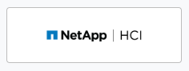
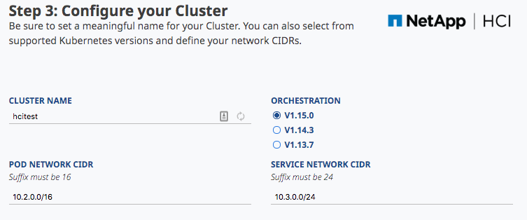
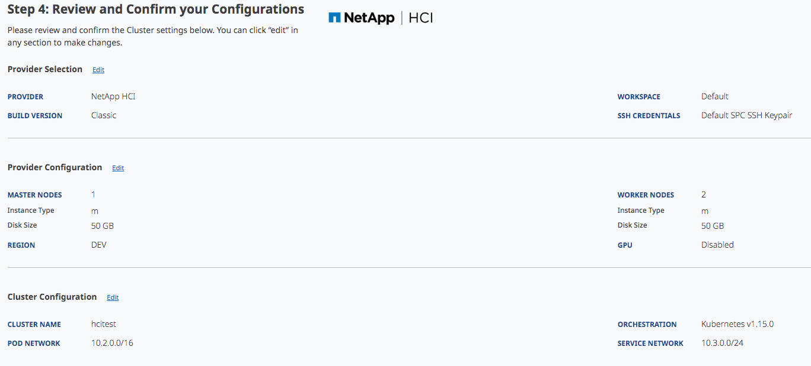
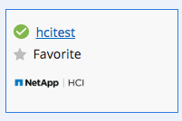
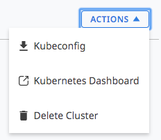
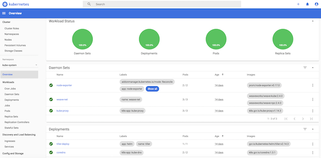
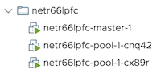
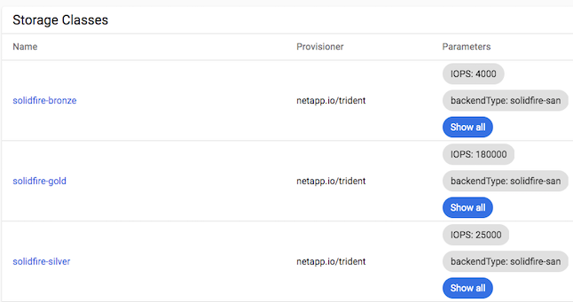

# NKS on HCI - Cluster Deployment

In this series of posts, we'll be covering how to get started with working with NKS on NetApp HCI. 

In this post we'll cover how to deploy a new cluster, and in future posts we'll be deploying an end-to-end CI/CD pipeline to deploy a custom application onto our cluster.

## Cluster Deployment Prerequisites

Before proceeding, there are a few requirements we'll need to make sure are in place. Take a look at the [NetApp HCI Requirements](https://docs.netapp.com/us-en/kubernetes-service/netapp-hci-requirements.html) page, which covers these in detail.

## Deploying a new cluster

If you've used NKS before to deploy a cluster against a major cloud provider, deploying a new HCI cluster follows a nearly identical process. First navigate to `Control Plane > Clusters` and click `+ Add Cluster` in the upper-right corner:


On the provider page, click the NetApp HCI Icon:



_note: if you dont see this icon available, your HCI has likely not been registered to NKS. See [Enable NKS for HCI](https://docs.netapp.com/us-en/kubernetes-service/hci-enable-nks-for-netapp-hci.html) for details._

The following page will allow customization of cluster hardware. We can set the number of master and worker nodes, as well as CPU/Mem/Disk resources for the nodes. The following instance sizes are available:

| Size | CPU  | MEM |
|:------------- |:-------------|:-----|
| M (default)   | 2    | 4 GB  |
| L             | 4    | 16 GB |
| XL            | 8    | 32 GB |


The `region` dialog will list the registered name of your HCI cluster.

On the following page, you can configure various aspects of the cluster- Customize the cluster name, set the K8S version, etc. For this example, we'll stick with the default values.



On the next page, we'll be shown a summary of our desired cluster configuration:



After clicking 'Create', NKS will start the cluster provisioning process.

Back on the clusters pane, we can see our new cluster being built. Once our cluster reaches the 'running' state, it will be ready to use:




## Cluster Access Options

The cluster details page provides a few ways for us to interact with the cluster, with available options listed in the sidepane:



### The Kubernetes Dashboard - Administration from Anywhere

The Kubernetes Dashboard provides a convenient interface for administering the cluster:



Unlike SSH and Kubectl, which rely on your client having a routable path to the cluster control plane, NKS provides access to the dashboard from anywhere. This works by estalishing a secure connection between NKS and the dashboard service running inside the cluster.

This means we can use the dashboard to administer the cluster from anywhere with access to NKS - no need for VPN.

### Cluster Hosts

On the vCenter administration page of the HCI cluster, we can see the virtual machines that have been deployed for the cluster:



#### Cluster ID

Take note of the prefix of the cluster machines- this is a unique ID generated for the cluster during creation. 

During cluster bootstrapping, NKS will provision a unique domain for the cluster using this id, which will take the form of: `<cluster id>.nks.cloud`. 

#### Ingress Service Discovery

All subdomains of _this_ domain will resolve to the IP of the cluster's ingress controller. By registering our own applications behind an ingress controller in the cluster, we can automatically resolve the service endpoint using this domain:


```
➜ ✗ nslookup my-app.netr66lpfc.nks.cloud 
...
Non-authoritative answer:
my-app.netr66lpfc.nks.cloud     canonical name = netr66lpfc.nks.cloud.
Name:   netr66lpfc.nks.cloud
Address: 10.61.185.88
```

We'll explore this in more detail in a future post.

### Trident Storage Classes

One of the benefits of using NKS with HCI is that by default, NKS can provision HCI volumes and dynamically expose them to cluster workloads via storage classes. It accomplishes this by using [Trident](https://github.com/NetApp/trident).

From the cluster details page, click the `Kubernetes Dashboard` link on the left pane to access the `kubernetes-dashboard` service running on the cluster. From the dashboard, navigate to 'Storage Classes' to view the default storage classes NKS has configured:



Since these are backed by SolidFire storage present in the HCI, we can leverage the guaranteed performance offered by SolidFire QOS and expose them to application workloads running in the cluster. We'll explore this in more detail in the future.

## Conclusion

In this post, we covered how to get started with using NKS with HCI, and deployed a new cluster.

In the next post in this series, we'll be taking a look at how we can deploy an application workload using SolidFire storage, and deploying an application onto our cluster using an NKS managed Helm chart.

