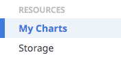
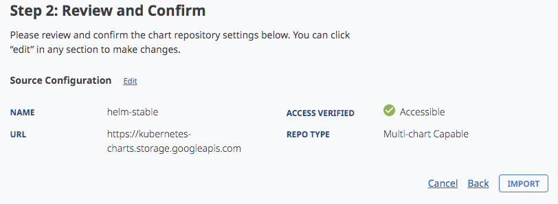

# NKS on HCI - Part 2

In this series of posts, we're covering various aspects of getting started with working with NKS on NetApp HCI. 

In this post, we'll be covering how to deploy an application to a existing cluster, using the curated Helm charts offered by NKS. If you dont have a cluster up and running, see [part 1](../part1_deployment/) of this series where we cover deployment of an NKS cluster onto HCI.

## Concept Overview


### NKS Solutions

 [NKS solutions](https://docs.netapp.com/us-en/kubernetes-service/solutions-intro.html) provide a simple you powerful model for for deploying applications onto Kubernetes. The following solution types are available:
- **Package** - Install an application from a [Helm Chart](https://github.com/helm/helm)
- **Application** - Install an application from a git repository
- **Tracker** - Monitor existing application resources based on specific labels

In this example, we'll use a **Package** type solution to deploy Jenkins onto our cluster.

### NKS Projects

A [Projects](https://docs.netapp.com/us-en/kubernetes-service/projects-intro.html) are designed to group together Solutions.  Clusters can have many Projects, and each Project can have many Solutions, including Applications, Packages, and Trackers. A Project could be a discrete microservice in your system, or a collection of microservices owned by a team in your Organization.

## Deploying a New Solution

Let's create a new Project and Solution to deploy Jenkins onto our cluster.

#### Create a new project

First, let's create a new project. On the left-hand pane, select `Projects`, then click the `+ Project` button to add a new project:


#### Select a target cluster

The project creation page will appear. Select a name for the project, and assign a target cluster, then click `Next`:


Next, we'll be taken to the project resource configuration page. Here, we can  set resource quotas for the project, such as CPU/Memory limits, max pods, etc:


For now, we can leave this blank and move on.

On the next page, we can review the details and settings for the project. If everything looks good, click `Create` to create the project.


### Import Helm Stable Chart Repository

Let's add the Helm-Stable repository to make Helm charts avaialble to deploy with NKS.

* From the left-hand pane, select `My Charts`
    * 

* Click `+ Chart Repository`
    * 

* Set the name to `helm-stable`

* Set the Source URL to `https://kubernetes-charts.storage.googleapis.com`
    * 

* Click `Next`. NKS will verify the repository is accessible. 
* Once access is verified, Click `Import` to create the repository.
    * 

* Back on the Chart Repositories page, NKS will start scanning the repository for Helm charts. After a few moments, we can see the charts have been imported, making them available for deployment to our cluster.
    * 


## Add Jenkins to the Project

Now, we're ready to deploy Jenkins to our cluster. We do this by adding Jenkins as a solution into our newly-created project. 

* Select `Projects` on the left-hand column, select the `Jenkins` project we created earlier, and click `+ Add Solution` in the top right corner:


* Select the `Package` solution type, and click `Next`
* Type `Jenkins` into the search bar, and select the chart from the `Helm-Stable` repository we added earlier, then click `Next`:


* Configuration


We'll now be taken to the solution settings page, where we are presented with the customization dialog:


### Customizing the Deployment

The customization page allows us to modify our application deployments in various ways. To keep things consistent, I'll call the release *jenkins* and deploy it into a *jenkins* namespace. 

In the bottom section of the dialog, we can customize the  `values.yaml` file from the underlying chart.
 
If you recall from the previous post, NKS uses NetApp Trident to expose SolidFire storage volumes to Kubernetes in the form of storage classes. Let's see how we can leverage this by customizing Jenkins to use SolidFire storage.


In the values pane, scroll down to the `Persistence` section. Within this section, uncomment the `StorageClass` line and set it to `solidfire-gold`:


Click `Next` to move onto the confirmation page, then Click `Create` to start the deployment.


## Trident in Action

On the cluster dashboard, navigate to the new `jenkins` namespace. Helm has deployed a number of items for Jenkins, including a deployment and pod to run the jenkins service.

Navigate to the pod info, and take note of the node it's running on:


### Element Volume

Navigating back to the HCI vCenter console, open the *NetApp Element Management* plugin and select the *volumes* tab. We can see that Trident has automatically created a new volume for Jenkins:


### Verifying the Volume Mount

This volume is mounted over iSCSI by the host running the target pod. We can confirm this fairly easily.

If we check the iscsi targets from the node running the Jenkins pod, we see our new volume has been mounted and exposed to the Pod:
```
root@netr66lpfc-pool-1-cnq42:/home/debian#  iscsiadm -m session
...
tcp: [2] 10.117.95.156:3260,1 iqn.2010-01.com.solidfire:b98j.jenkins-jenkins-125cd.765 (non-flash)
```

Behind the scenes, NKS and Trident has configured all of this automatically - all we needed to do was select a storage class. Pretty neat!

## Accessing the Jenkins Endpoint

Now we're ready to access Jenkins. Open the Kubernetes dashboard, and take a look at the *Services* in the *jenkins* namespace. Take note of the URL in the *external endpoints* colummn:


Navigating to that url, we are presented with the Jenkins login page:


## Conclusion

In this post, we introduced using NKS Solutions to quickly get Jenkins up and running on our Kubernetes cluster. We also took a closer look into how we can leverage Trident storage classes to easily expose SolidFire storage to containerized workloads.

In the next post, we'll be configuring Jenkins, building a pipeline, and running our first builds.

