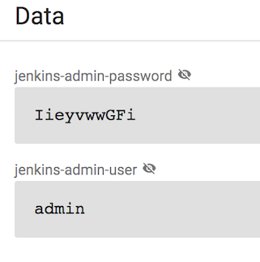
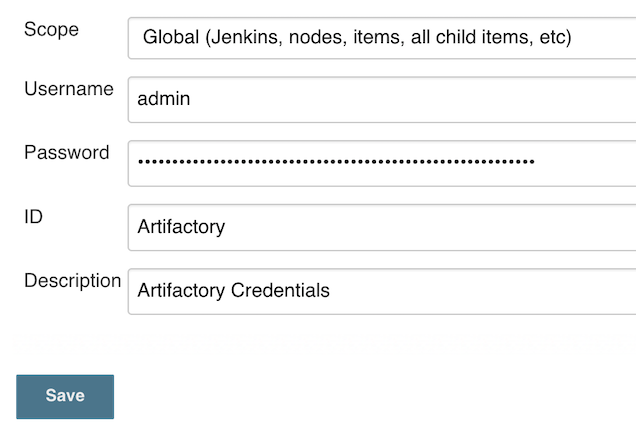
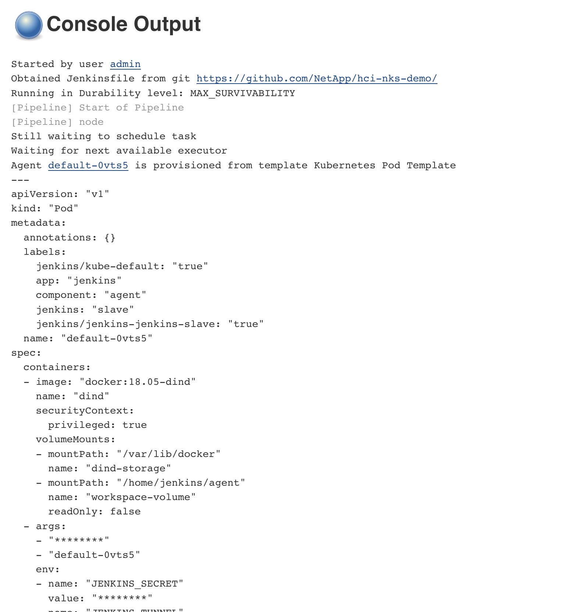
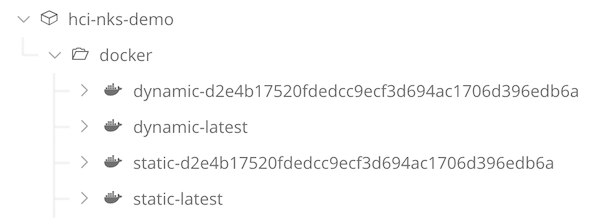

# NKS on HCI - Part 3 - Customizing Jenkins


In this series of posts, we're covering various aspects of getting started with building a CI/CD Pipeline using NKS with NetApp HCI.

In this post, we'll configure the Jenkins deployment that was deployed in part 2, build a pipeline, and run our first builds. For this example I'll be using a small demo application, the repository of which can be found [here](https://github.com/NetApp/hci-nks-demo/tree/master). This project contains 2 docker images, as well as a Jenkinsfile that will be used to run the pipeline.

## Requirements
* You'll need to have the `kubectl` command-line tool installed and configured to access your cluster. See [Install Kubectl to Control a Kubernetes Cluster](https://docs.netapp.com/us-en/kubernetes-service/install-kubectl-to-control-a-kubernetes-cluster.html) for details.
* Your clusters ingress controller should be configured with an IP address. [See here for details](../../setup/metallb)

## (Optional) Deploying Artifactory

If you'd like to self-host your images via Artifactory, see [Deploying Artifactory on NKS](../deploy_artifactory). Otherwise, create an account on [Docker Hub](https://hub.docker.com/) or another public registry.

## Configuring Jenkins

Now we're ready to configure Jenkins.

Since we're using a `Package` type solution, our application can be customized by modifying its associated `values.yaml` file, which we can do from the NKS Solutions interface.

From the NKS Portal, click the `Solutions` button on the left pane, select the `jenkins` Solution, and the `Settings` tab.

Now we're ready to configure the deployment. We'll base our configuration from the [template defined here](./templates/jenkins.yaml).

#### Ingress 

To configure the ingress controller, we just need our cluster id. The cluster id is the random prefix of the cluster nodes.

In this example, the cluster id is `netp5fki6k`.
```
~ kubectl get nodes
NAME                      STATUS   ROLES
netp5fki6k-master-1       Ready    master
netp5fki6k-pool-1-gqtkl   Ready    <none>
netp5fki6k-pool-1-trjhx   Ready    <none>
```

Replace `<YOUR_CLUSTER_ID>` in the template with your own cluster id.

```
master:
  ingress:
    enabled: true
    annotations:
      kubernetes.io/ingress.class: nginx
    hostName: jenkins.<YOUR_CLUSTER_ID>.nks.cloud
    tls:
    - secretName: wildcard-cert
```

This will configure your cluster's ingress controller to make jenkins accessible via hostname. e.g. `jenkins.netp5fki6k.nks.cloud`


### Retrieving the Jenkins Password

By default, Helm will generate a random password for the Jenkins **admin** user during deployment. We'll need to retrieve this password to login to the Jenkins console.

#### Via the K8S Dashboard

Open the Kubernetes Dashboard from the cluster details page, and navigate to the **jenkins** namespace.

Within this namespace the Jenkins credentials can be found in the `data` section of the `jenkins` Opaque secret:



#### Via Kubectl

The jenkins credentials can also be retrieved using Kubectl by running the following command:

```
$ kubectl get secrets jenkins  -n jenkins -o 'go-template={{index .data "jenkins-admin-password"}}' | base64 --decode
$ IieyvwwGFi
```

After retrieving the default password, we can log into Jenkins as the **admin** user.

## Jenkins Configuration

Since we deployed our Jenkins instance from a package template, most of the necessary configuration and setup steps are already taken care of. However, in order to get our pipeline fuctional, we'll just need to configure one additional item- a set of credentials to access our Docker registry.


### Add Docker Registry Credentials

Let's add the credentials to our Docker registry. If you deployed Artifactory above, then these will be the credentials to your artifactory instance. Otherwise, enter the credentials for your Docker Hub account. These will be referenced in the Pipeline and used to push the application images.

On the left-side column, select `Credentials > Jenkins > Global Credentials`, then click `Add Credentials`.




### Run Pipeline

On the left-side column, click **Build Now** to run the pipeline. Selecting the job details will display a running log of the build output. This job will perform the following actions:

* Cloning the remote repository
* Build/Test application images
* Push images to registry




### View artifacts

Navigating into Artifatory, we can see our images have been stored:




### Conclusion

In this post, we configured Jenkins with a new pipeline to run jobs in Kubernetes. We also saw an example of how to use the pipeline to build, test, and store the images for a custom application. 

In the next post, we'll explore how to deploy our application into a Kubernetes cluster with a custom helm chart using NKS.


