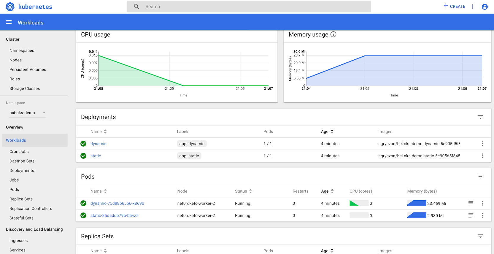

# NKS on HCI - Part 4

In this series of posts, we're covering various aspects of getting started with building a CI/CD Pipeline using NKS with NetApp HCI.

Over the last three posts, we've created a new K8S cluster, deployed Jenkins and Artifactory, and configured a pipeline to run our first builds. In this final post in the series, we'll be exploring how we can import a custom helm chart into NKS, and use it to deploy our custom application right from the NKS portal.

## Using Custom Charts with NKS Solutions

In a previous post, we used NKS Solutions to deploy Jenkins and Artifactory to a cluster. Built around the powerful package manager and templating engine Helm, NKS Solutions provide a convenient means of deploying pre-packaged applications to Kubernetes.

However, we can also leverage NKS Solutions to import, customize, and deploy our own Helm charts for a custom application, all from within the NKS portal.

### Import a Custom Chart

The Helm chart which we can use to deploy our custom application is available here: https://github.com/NetApp/hci-nks-demo/tree/master/k8s/hci-nks-demo

This chart will create a deployment and service for each of the 2 sub-components of our application.

To import a custom chart, navigate to the NKS portal, select `Solutions` and `Import Charts`:

On the next page, enter a name for the new repository, along with the URL of the location of your chart(s):

After clicking the confirmation, NKS will search for any charts in the repository, and add them to your profile:

### Deploy a Custom Chart

Now that the chart has been imported, we can use NKS Solutions to deploy it into our cluster. Navigate to the Cluster Detail page, and click the `+ Add Solution` button to add a solution to the cluster.

On the next page, we'll be presented with a list of available applications. Select `My Charts` from the top column.

Here we will see a new icon for our imported chart:

Selecting the chart, we can see the `values.yaml` file is available for us to use to customize the deployment. Here I'll set the `image` key to the latest image built by Jenkins:

After configuring our desired values, NKS will begin deploying the resources specified in our custom chart to the cluster.

After a few minutes, navigating back to the cluster dashboard, we can see a new namespace has been created for our project: `hci-nks-demo`.

Navigating into this namespace, we can see the Deployments and Services specified in our custom chart have been created in the cluster:

  

## Conclusion

In this series of posts, we've introduced the core components of the NKS platform, and have shown how we can get started with NKS to implement CI/CD for our application workloads. From deploying a new cluster, installing Jenkins and configuring pipelines, to building and deploying our custom application, we can see how each step in this process can be simplified by leveraging NKS.

In an upcoming series, we'll be diving into the new features avaiable as part of the [NKS v2 Release](https://nks.netapp.io/v2/), and will focus on key areas like high-availablility, observability, and disaster recovery.

